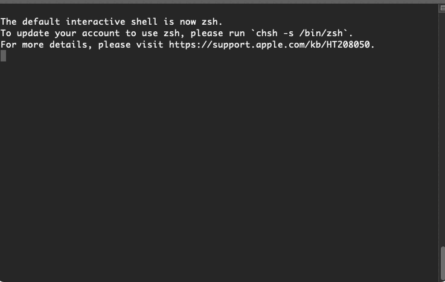
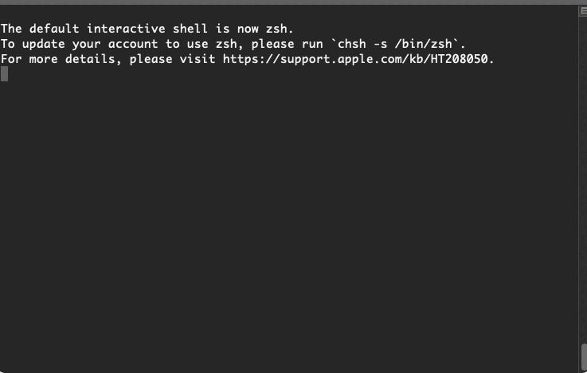

# DataCop

<p align="center"></p>

---

DataCop is an custom AWS framework that mitigates the 
potential of vulnerable S3 buckets. Reliant on AWS Macie results, DataCop enables professionals that leverage AWS Macie
to automatically block S3 buckets that contain PII or any classified information.

Features
---

* Automatically provisioned infrastructure to bridge the 
cap between Macie and S3 with AWS CDK
* Configurable settings for bucket blocking (containment)
* Event-driven S3 bucket blocking (containment)

Setup & Installation
---

### Requirements

In order to install and deploy DataCop, you need
to ensure that you have the following installed:

- Python 3.8+

### Install

The installation process for DataCop is fairly straightforward. Please follow the steps
outlined below:

1. Create and activate your virtual environment:
    
    #### Figure 1. Create/Activate Virtual Environment
    ```bash
    $ python -m venv .datacop-venv
    (datacop-venv) $ # You've activated your VENV
    ```

    

2. Install the dependencies:

    #### Figure 2: Install Python Dependencies
    ```text
    (datacop-venv) $ pip install -r requirements.txt
    ```
    
    

Once you've installed those requirements, you're good to deploy the application.

Commands
---

This project uses `invoke` to execute commands for both development and deployment.
If you would like to learn more about invoke, please refer to this document: [Invoke Docs](https://www.pyinvoke.org).

#### Figure 3. List of commands
```text
(datacop-venv) $ inv --list

Available tasks:
  deploy                Bootstraps and deploys the CDK templates to AWS
  destroy               Destroys the CDK templates within AWS
  destroy-and-disable   Destroys the CDK templates and disables Macie
  disable-macie         Disables macie for the account.
  format                Formats all of the python files within the project
  format-check          Checks the formatting of the code within the project
  lint                  Executes pylint to check for any linting issues/errors
  post-setup            Executes post setup configuration steps for Macie
  pre-setup             Configures environment deploying infrastructure
  test                  Executes unit test cases
```

Deployment
---

Assuming you have activated your virtual environment, 
run the following command to deploy the CDK stack:
    
#### Figure 4. Deploying DataCop
```text
(.env) $ invoke deploy
```

>**NOTE:** This command will bootstrap the default AWS account & profile.
Afterward, it will deploy everything with `cdk deploy`.

To review the results, please log into your AWS account and verify
that the following CloudFormation Template exists: `DataCopCoreStack`.

Want to contribute?
---

If you want to contribute, please take a 
look at the [Contributing Documentation](./documentation/contributing.md).