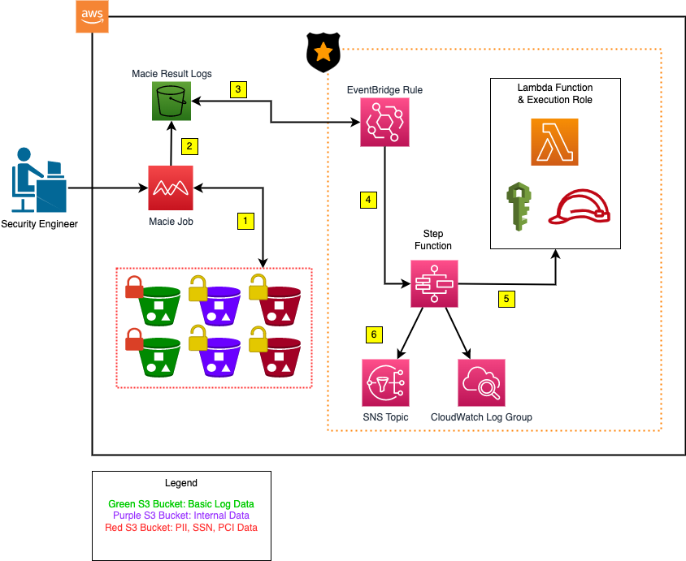

# Architecture: DataCop

---

This diagram highlights the architecture of DataCop. Each of the numbers represent the flow
of how DataCop works. 

## Scenario w/ Explanation

A disgruntled employee decides to create an S3 bucket with public access enabled
and no ACL's attached. With this bucket, they've also decided to upload some data
that they've sensitive data that contains PII and PCI data that could hurt the organization's
reputation and revenue. Their manager finds out and alerts the infosec team.

The security engineer, Ricky, decides to execute a Macie scan against the bucket, which
has the DataCop framework backing it. If there are some data risks (user-specified), here are the actions
that will take place in the order specified in the diagram:

1. Ricky executes the Macie's Job against the S3 buckets.
2. The macie's results are sent to the Macie's Result Log S3 bucket. 
3. The results that are published to the bucket are detected by the EventBridge rule for DataCop.
4. Based on the file(s) that are uploaded to the result's bucket, the DataCop step function
is triggered.
5. For each step function state, the lambda function will be triggered. The step function contains the following states:
    - `send_error_report`: Sends an error report to whoever the reporter is
    - `determine_severity`: Determines the severity of the files that are within the S3 bucket
    - `check_bucket_status`: Checks to see if the S3 bucket has been blocked already - (Macie sends multiple files per scan)
    - `block_s3_bucket`: Blocks the vulnerable S3 bucket.
    - `send_report`: Sends the report of the block S3 bucket.
    - `Ignore Bucket`: Ignores the S3 bucket if it has been blocked already.
6. If the S3 bucket has been blocked successfully, the step function will send the results to email address(es)
that is subscribed to the SNS Topic.