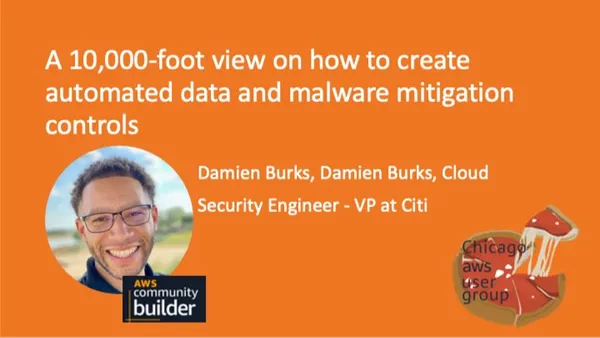

AWS User Group - Chicago
---

---

This section of the repository contains the slide deck that I used to speak at [AWS User Group - Chicago](https://www.meetup.com/aws-chicago/events/291367444/).
The title of the presentation was called: _"A 10,000-foot view on how to create automated data and malware mitigation controls"_

The links to the slide deck and YouTube video are highlighted below:
- Slide Deck: [AWS User Group Presentation](./aws_user_group_presentation_final.pptx)
- YouTube Video: Coming soon

**PS:** This was the first AWS User Group that I've presented for. Thank you so much
Margaret for letting me talk to your members. One day... I'll be there in person! :smile 